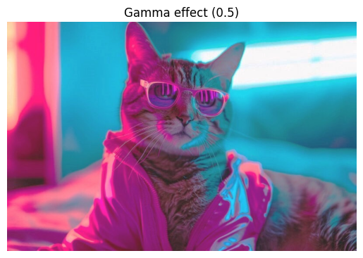
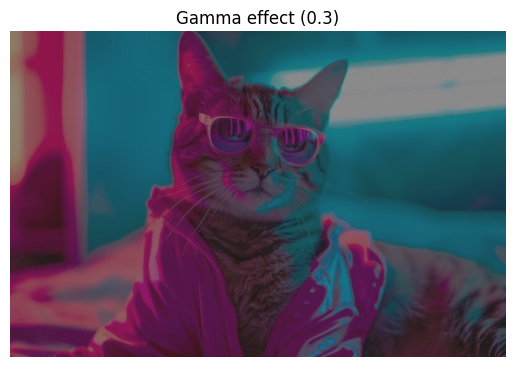
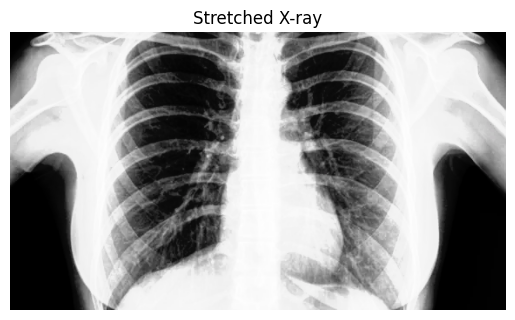
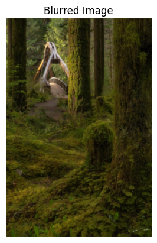

# Importing Libraries


```python
import math
import cv2
import matplotlib.pyplot as plt
import numpy as np

```

# Question 1
- ### Comparing histogram of twp different images
In this part `Q1` and `Q1_1` are same images but with different contrast, the histogram shown bellow compares the  pixel intensity of these images. It can be said that increasing the contrast pushes pixel intensities toward the extremes. This results in a histogram with more pixels at the lower and higher ends of the intensity scale and fewer in the middle. 


```python
    img = cv2.imread("images/Q1.jpg", 1)
    img_con = cv2.imread("images/Q1_1.jpg", 1)

    img_q2 = cv2.imread("images/Q1_2.jpg", 1)
    img_q3 = cv2.imread("images/Q1_3.jpg", 1)

    histogram_q1 = cv2.calcHist([img], [0], None, [256], [0, 256])
    histogram_const = cv2.calcHist([img_con], [0], None, [256], [0, 256])

    plt.plot(histogram_q1, label='Normal image')
    plt.plot(histogram_const, label="High Contrast Image")
    plt.title("Histogram of Image 1")
    plt.xlabel("Pixel Intensity")
    plt.ylabel("Frequency")
    plt.legend()
    plt.show()

    histogram_q2 = cv2.calcHist([img_q2], [0], None, [256], [0, 256])
    histogram_q3 = cv2.calcHist([img_q3], [0], None, [256], [0, 256])

    plt.plot(histogram_q1, label='Image 1')
    plt.plot(histogram_q2, label='Image 2')
    plt.plot(histogram_q3, label='Image 3')
    plt.title("Different image Histogram")
    plt.xlabel("Pixel Intensity")
    plt.ylabel("Frequency")
    plt.legend()
    plt.show()
```


    

    


    

    


- ### Comparative Histograms: 
By examining the histograms of `Q1`, `Q1_2`, and `Q1_3`, we can observe differences in brightness and contrast, revealing how pixel intensities vary across images.

# Question 2


```python
    img = cv2.imread("images/Q2.jpg", 0)
    mean = np.mean(img)

    gamma_1 = math.log(0.5 * 255) / math.log(mean)
    gamma_2 = math.log(0.3 * 255) / math.log(mean)
    gamma_3 = math.log(0.75 * 255) / math.log(mean)

    img_gamma1 = np.power(img, gamma_1).clip(0, 255).astype(np.uint8)
    img_gamma2 = np.power(img, gamma_2).clip(0, 255).astype(np.uint8)
    img_gamma3 = np.power(img, gamma_3).clip(0, 255).astype(np.uint8)
    
    plt.axis('off')
    plt.title('Gamma effect (0.5)')
    plt.imshow(cv2.cvtColor(img_gamma1, cv2.COLOR_BGR2RGB))
    
    plt.show()  
    
    plt.axis('off')
    plt.title('Gamma effect (0.3)')
    plt.imshow(cv2.cvtColor(img_gamma2, cv2.COLOR_BGR2RGB))
    
    plt.show()
    plt.axis('off')
    plt.title('Gamma effect (0.75)')
    plt.imshow(cv2.cvtColor(img_gamma3, cv2.COLOR_BGR2RGB))
```


    

    


    

    


    <matplotlib.image.AxesImage at 0x12e656240>


    

    


# Question 3

 The **Median filter** is commonly used to reduce noise while preserving edges, specially for images with salt and pepper noise.


```python
    img = cv2.imread("images/Q3.jpg", 1)  
    hist = cv2.calcHist([img], [0], None, [256], [0, 256])
    plt.plot(hist)
    plt.title("Histogram")
    plt.xlabel("Pixel Intensity")
    plt.ylabel("Frequency")
    plt.show()
```


    

    


# Question 4


```python
img_input = cv2.imread('images/Q4.jpg')
img_ref = cv2.imread('images/Q4_ref.jpg')


def calculate_cdf(hist):
    cdf = np.cumsum(hist)
    cdf_normalized = cdf * 255 / cdf[-1]  # Normalize to range [0, 255]
    return cdf_normalized


# Calculate histograms and CDFs for input and reference images
hist_input = cv2.calcHist([img_input], [0], None, [256], [0, 256])
cdf_input = calculate_cdf(hist_input)

hist_ref = cv2.calcHist([img_ref], [0], None, [256], [0, 256])
cdf_ref = calculate_cdf(hist_ref)

# Create a mapping from the input image to the reference image
mapping = np.zeros(256)
for i in range(256):
    # Find the closest match in the reference CDF
    diff = np.abs(cdf_ref - cdf_input[i])
    mapping[i] = np.argmin(diff)

# Apply the mapping to create the matched image
matched_image = np.zeros_like(img_input)
for i in range(img_input.shape[0]):
    for j in range(img_input.shape[1]):
        matched_image[i, j] = mapping[img_input[i, j]]

plt.figure()
plt.axis('off')
plt.title('Matched Image')
plt.imshow(matched_image)
plt.show()

```


    

    


# Question 5


```python
    xray_image = cv2.imread('images/Q5.jfif', 0)

    equalized_image = cv2.equalizeHist(xray_image)
    darkened_image = (xray_image * 0.5).astype('uint8')
    darkened_equalized_image = cv2.equalizeHist(darkened_image)
    
    plt.axis('off')
    plt.title('Equalized X-ray')
    plt.imshow(cv2.cvtColor(equalized_image, cv2.COLOR_BGR2RGB))
    
    plt.show()
    plt.axis('off')
    plt.title('Darkened X-ray')
    plt.imshow(cv2.cvtColor(darkened_image, cv2.COLOR_BGR2RGB))
    
    plt.show()
    plt.axis('off')
    plt.title('Equalized Darkened X-ray')
    plt.imshow(cv2.cvtColor(darkened_equalized_image, cv2.COLOR_BGR2RGB))
    # cv2.imshow("Equalized X-ray", equalized_image)
    # cv2.imshow("Darkened X-ray", darkened_image)
    # cv2.imshow("Equalized Darkened X-ray", darkened_equalized_image)
    # cv2.waitKey(0)
    # cv2.destroyAllWindows()
```


    

    


    

    


    <matplotlib.image.AxesImage at 0x12e7d79b0>


    

    


# Question 6

### Low-pass filter
Low-pass filters are used to smooth or blur images by removing high-frequency components. The result in this case is a softened image. like Gaussian filter
### High-pass filter
High-pass filters are used to enhance the high-frequency components of an image. Like edges details and textures.They remove the low-frequency components which makes the sharper details to stand out more in the image.


# Question 9

- #### What Problem Does Histogram Clipping Solve?

Clipping helps prevent noise and unnatural-looking parts in the image. It keeps contrast enhancement from going too far, making the image look balanced and less noisy.


```python
    xray_image = cv2.imread('images/Q5.jfif', 1)
    xp = [0, 64, 128, 192, 255]
    fp = [0, 16, 128, 240, 255]
    x = np.arange(256)
    table = np.interp(x, xp, fp).astype('uint8')
    xray_stretched = cv2.LUT(xray_image, table)

    plt.axis('off')
    plt.title('Original X-ray')
    plt.imshow(cv2.cvtColor(xray_image, cv2.COLOR_BGR2RGB))
    
    plt.show()
    
    plt.axis('off')
    plt.title('Stretched X-ray')
    plt.imshow(cv2.cvtColor(xray_stretched, cv2.COLOR_BGR2RGB))
```


    

    


    <matplotlib.image.AxesImage at 0x12e89ba70>


    

    


# Question 10


```python
    img = cv2.imread('images/Q10_1.jpg', 1)
    kernel = np.array([[-1, -1, -1], [-1, 9, -1], [-1, -1, -1]])
    sharp_image = cv2.filter2D(img, -1, kernel)
    
    img_2 = cv2.imread('images/Q10_2.jpg', 1)
    blur_image = cv2.medianBlur(img, 5)

    plt.axis('off')
    plt.title('Sharpened Image')
    plt.imshow(cv2.cvtColor(sharp_image, cv2.COLOR_BGR2RGB))
    
    plt.show()
    
    plt.axis('off')
    plt.title('Blurred Image')
    plt.imshow(cv2.cvtColor(blur_image, cv2.COLOR_BGR2RGB))
```


    

    


    <matplotlib.image.AxesImage at 0x12e898740>


    

    


```python

```
